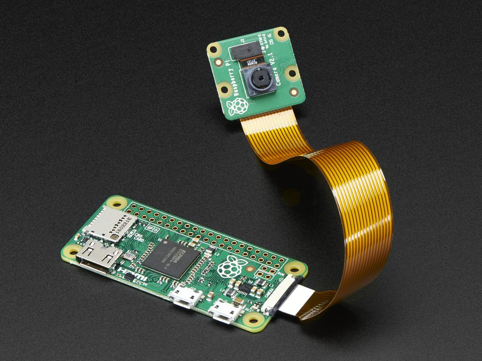
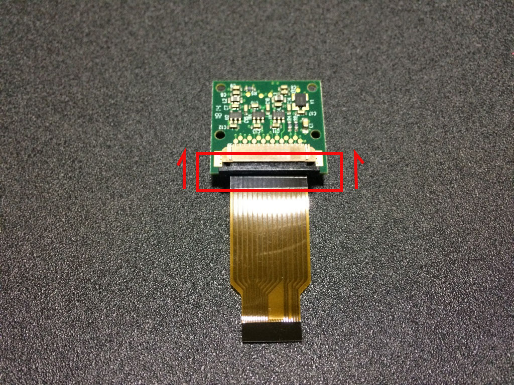
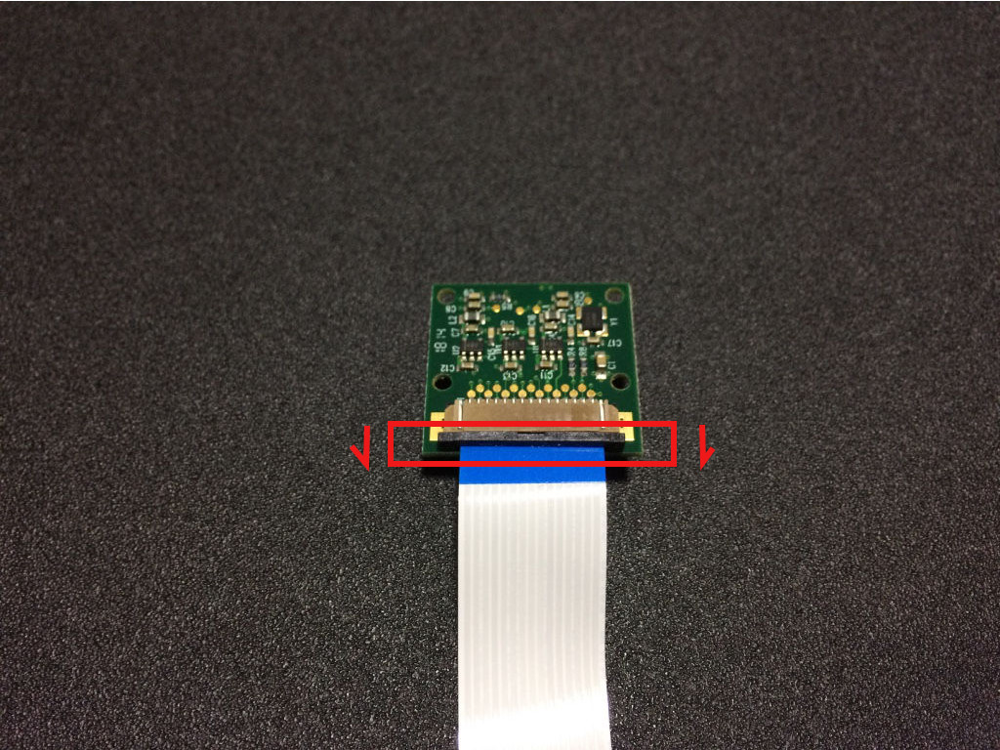
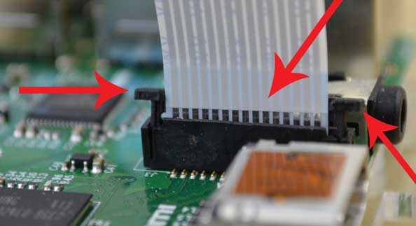
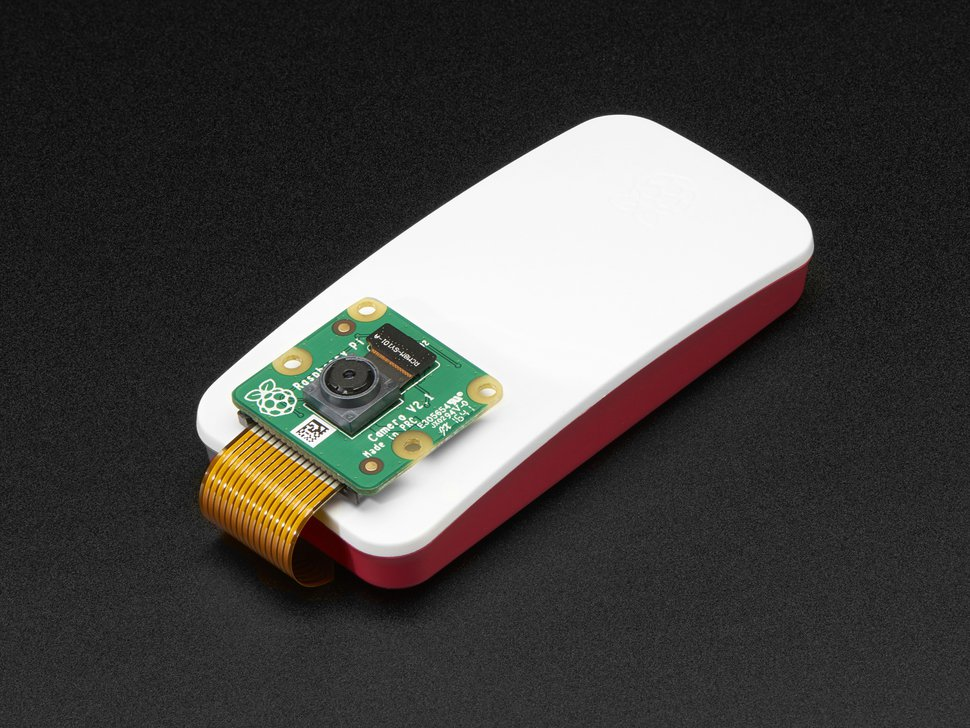
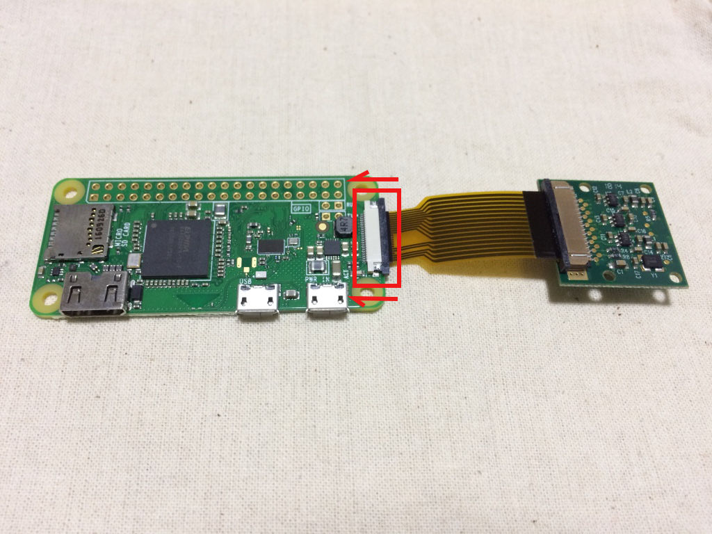
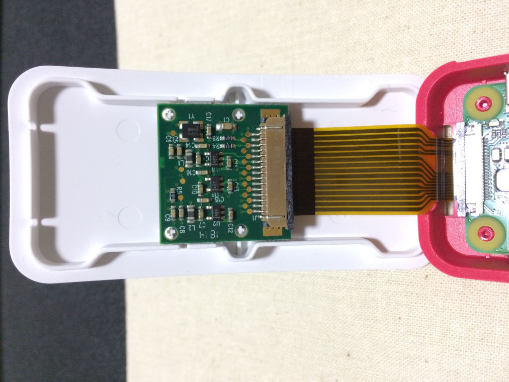
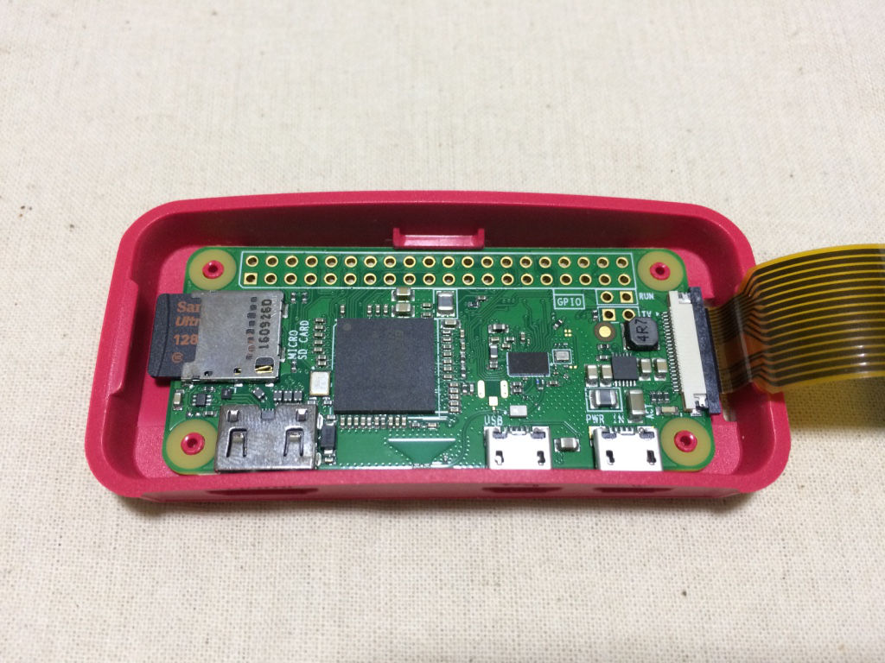

# Grabbing Video on a Raspberry Pi Using OpenCV


```
sudo apt install v4l-utils
```

You should see `/dev/video0` for the picamera v2.1.

```
pi@lcd:~ $ v4l2-ctl --device /dev/video0 --list-formats-ext
ioctl: VIDIOC_ENUM_FMT
    Type: Video Capture

    [0]: 'YU12' (Planar YUV 4:2:0)
        Size: Stepwise 32x32 - 3280x2464 with step 2/2
    [1]: 'YUYV' (YUYV 4:2:2)
        Size: Stepwise 32x32 - 3280x2464 with step 2/2
    [2]: 'RGB3' (24-bit RGB 8-8-8)
        Size: Stepwise 32x32 - 3280x2464 with step 2/2
    [3]: 'JPEG' (JFIF JPEG, compressed)
        Size: Stepwise 32x32 - 3280x2464 with step 2/2
    [4]: 'H264' (H.264, compressed)
        Size: Stepwise 32x32 - 3280x2464 with step 2/2
    [5]: 'MJPG' (Motion-JPEG, compressed)
        Size: Stepwise 32x32 - 3280x2464 with step 2/2
    [6]: 'YVYU' (YVYU 4:2:2)
        Size: Stepwise 32x32 - 3280x2464 with step 2/2
    [7]: 'VYUY' (VYUY 4:2:2)
        Size: Stepwise 32x32 - 3280x2464 with step 2/2
    [8]: 'UYVY' (UYVY 4:2:2)
        Size: Stepwise 32x32 - 3280x2464 with step 2/2
    [9]: 'NV12' (Y/CbCr 4:2:0)
        Size: Stepwise 32x32 - 3280x2464 with step 2/2
    [10]: 'BGR3' (24-bit BGR 8-8-8)
        Size: Stepwise 32x32 - 3280x2464 with step 2/2
    [11]: 'YV12' (Planar YVU 4:2:0)
        Size: Stepwise 32x32 - 3280x2464 with step 2/2
    [12]: 'NV21' (Y/CrCb 4:2:0)
        Size: Stepwise 32x32 - 3280x2464 with step 2/2
    [13]: 'BGR4' (32-bit BGRA/X 8-8-8-8)
        Size: Stepwise 32x32 - 3280x2464 with step 2/2

```

## Example

```python
import cv2

# Open the device at the ID 0
# Use the camera ID based on
# /dev/videoID needed
cap = cv2.VideoCapture(0)

#Check if camera was opened correctly
if not (cap.isOpened()):
    print("Could not open video device")


#Set the resolution
cap.set(cv2.CAP_PROP_FRAME_WIDTH, 1920)
cap.set(cv2.CAP_PROP_FRAME_HEIGHT, 1080)

# Capture frame-by-frame
while(True):
    ret, frame = cap.read()

    # Display the resulting frame

    cv2.imshow("preview",frame)

    cv2.imwrite("outputImage.jpg", frame)

    #Waits for a user input to quit the application
    if cv2.waitKey(1) & 0xFF == ord('q'):
        break

# When everything done, release the capture
cap.release()
cv2.destroyAllWindows()
```

## Zero

{width=75%}

{width=75%}

It can be confusing how to install the ribbon cable, but putting the tin leads of the
ribbon cable facing the green PCB (see picture) and the white (or blue) backing facing
away from the PCB.

## Raspberry Pi

{width=75%}



The camera is the same, but on the board, you want the tin connections to be facing
away from the USB/Ethernet ports.

# Pi Zero Case

{width=75%}

{width=75%}

{width=75%}

{width=75%}

# Specs

The Pi Camera

  Param                 Camera v1                             Camera v2
  --------------------- ------------------------------------- -------------------------------------
  Size                  around 25 x 24 x 9 mm                 same
  Weight                3g                                    same
  Still resolution      5 Megapixels                          8 Megapixels
  Video modes           1080p30, 720p60 and 640 × 480p60/90   1080p30, 720p60 and 640 × 480p60/90
  Linux integration     V4L2 driver available                 V4L2 driver available
  C programming API     OpenMAX IL and others available       OpenMAX IL and others available
  Sensor                OmniVision OV5647                     Sony IMX219
  Sensor resolution     2592 × 1944 pixels                    3280 × 2464 pixels
  Sensor image area     3.76 x 2.74                           same
  Pixel size            1.4 µm x 1.4 µm                       same
  Optical size          1/4\"                                 same
  SLR lens equivalent   35 mm                                 same
  S/N ratio             36 dB                                 same
  Dynamic range         67 dB @ 8x gain                       same
  Sensitivity           680 mV/lux-sec                        same
  Dark current          16 mV/sec @ 60 C                      same
  Well capacity         4.3 Ke-                               same
  Fixed focus           1 m to infinity                       same

### Camera Modes

  --------------------------------------------------------------------------------
  \#   Resolution   Aspect Ratio Framerates    Video   Image   FoV       Binning
  ---- ------------ ------------ ------------- ------- ------- --------- ---------
  1    1920x1080    16:9         1-30fps       x               Partial   None

  2    2592x1944    4:3          1-15fps       x       x       Full      None

  3    2592x1944    4:3          0.1666-1fps   x       x       Full      None

  4    1296x972     4:3          1-42fps       x               Full      2x2

  5    1296x730     16:9         1-49fps       x               Full      2x2

  6    640x480      4:3          42.1-60fps    x               Full      4x4

  7    640x480      4:3          60.1-90fps    x               Full      4x4
  --------------------------------------------------------------------------------

# Testing

Grab a still image:

    raspistill -o cam.jpg

Grab video:

    raspivid -o vid.h264


# References

- [How to Capture Frames from Camera with OpenCV in Python](https://developer.ridgerun.com/wiki/index.php?title=How_to_Capture_Frames_from_Camera_with_OpenCV_in_Python)
- [Pi Camera Specs](https://www.raspberrypi.org/documentation/hardware/camera/README.md)
