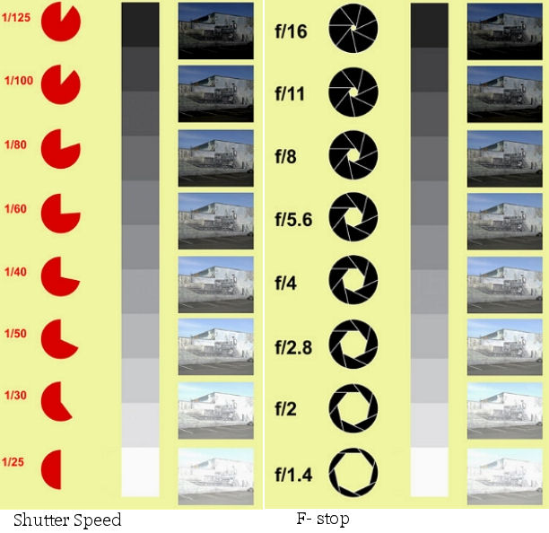
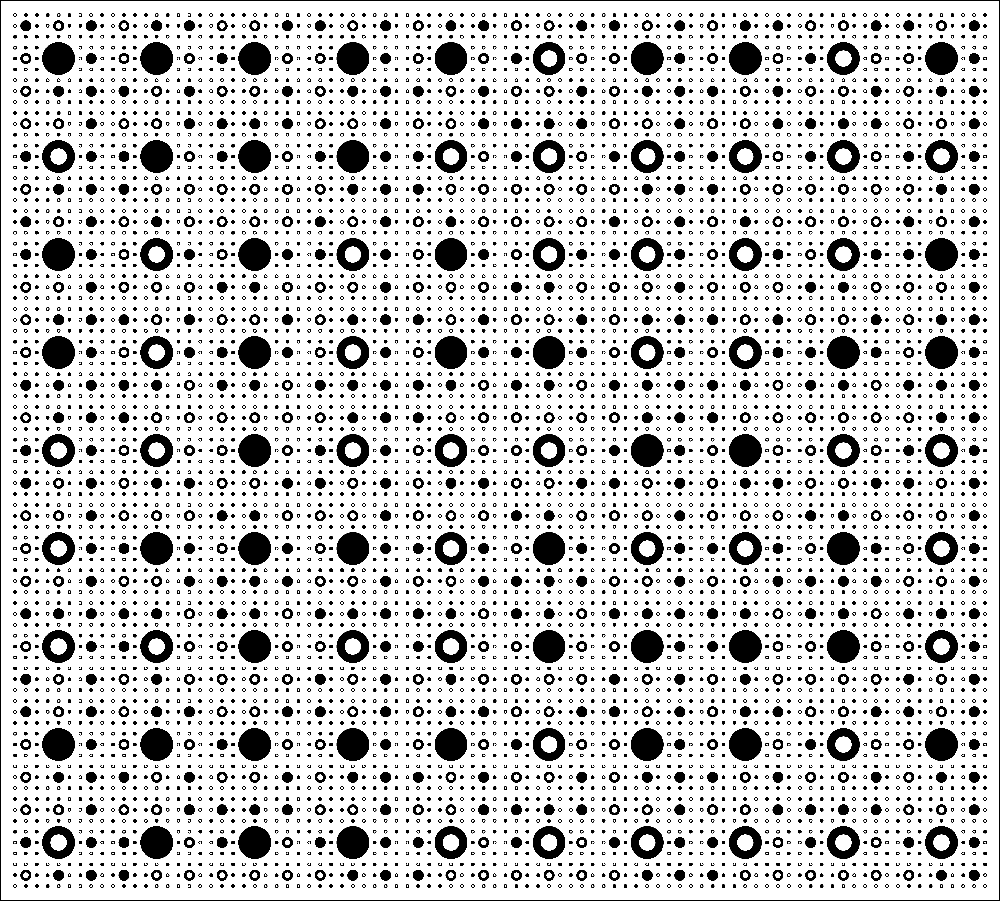
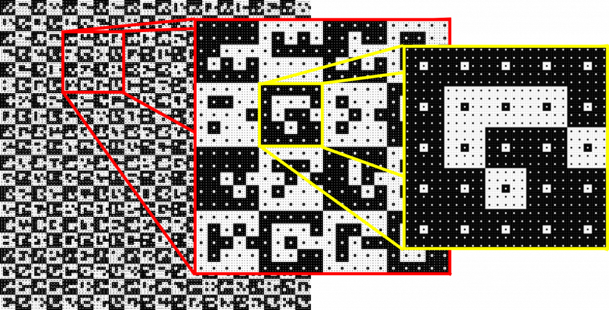
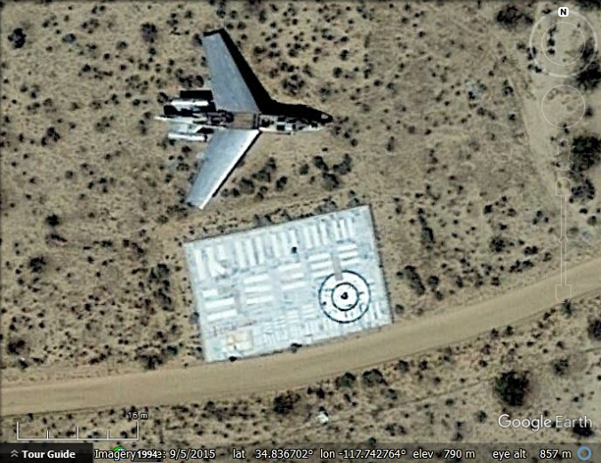
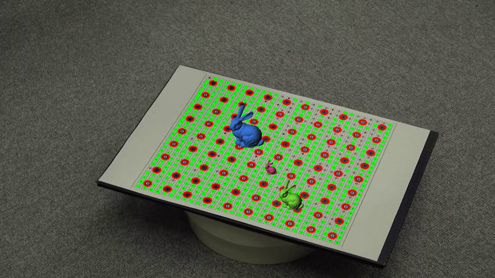
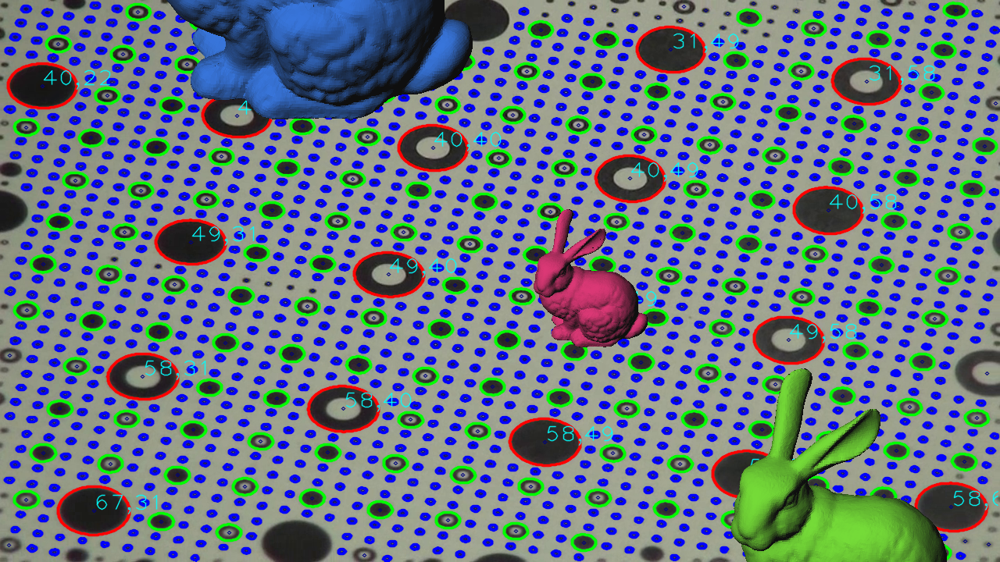

Kevin J. Walchko, Phd 

----

Most useful robotics work requires calibrated camera in order to properly use the information distilled from each image. This will cover calibration of a single camera, but the basics apply to stereo calibration.

## References

- [OpenCV 3.3 Docs](http://docs.opencv.org/3.3.0/)
- [OpenCV 2.4 Camera Calibration](http://docs.opencv.org/2.4/modules/calib3d/doc/camera_calibration_and_3d_reconstruction.html)
- [Scott's work - I can't find the link again](tbd)
- [skimage ransac library](http://scikit-image.org/docs/dev/api/skimage.measure.html#skimage.measure.ransac)
- [Fractal Target: Camera Calibration for Light Fields and Camera Arrays](http://lightfieldgroup.iwr.uni-heidelberg.de/?page_id=1066)
- [Circle Grid Fractal Pattern for Calibration at Different Camera Zoom Levels](http://www.k2.t.u-tokyo.ac.jp/mvf/FractalCalibrationPattern/index-e.html)
- [Robotics with ROS](ros-developer.com)
- [Demystifying Geometric Camera Calibration for Intrinsic Matrix](https://kushalvyas.github.io/calib.html)
- Medium: [Camera Calibration with OpenCV](https://medium.com/analytics-vidhya/camera-calibration-with-opencv-f324679c6eb7)

## Setup

- lenses made today generally allow the light rays to pass straight through without adversly affecting their path. However, depending on your application, you may need to calibrate your camera to produce a better picture. Stereo vision and video odometry are two such applications where sub pixel performance needs to be good in order to obtain good results.

# Camera Model

The functions in this section use a so-called pinhole camera model. In this model, a scene view is formed by projecting 3D points into the image plane using a perspective transformation.

$$
\begin{eqnarray}
  s p' = A[R|t]P' \\
  s \begin{bmatrix} u\\ v\\ 1 \end{bmatrix} = 
  \begin{bmatrix}
    f_x & a & c_x \\
    0 & f_y & c_y \\
    0 & 0 & 1
  \end{bmatrix}
  \begin{bmatrix} R_{3x3} & t_{xyz} \end{bmatrix}
  \begin{bmatrix} X \\ Y \\ Z \\ 1 \end{bmatrix}
\end{eqnarray}
$$

where:

- P(X, Y, Z) are the coordinates of a 3D point in the world coordinate space
- p(u, v) are the coordinates of the projection point in pixels
- A is a camera matrix, or a matrix of **intrinsic** parameters (think internal parameters)
- (cx, cy) is a principal point that is usually at the image center
- fx, fy are the focal lengths expressed in pixel units
- [R|t] are the **extrinsic** parameters (think external parameters)
- a is a skewing parameter that transforms square pixels into parallograms. Note, this is only a simple skewing in 1 parameter, it can effect all off diagional terms in the top, left 3x3.

The matrix of intrinsic parameters does not depend on the scene viewed. So, once estimated, it can be re-used as long as the focal length is fixed (in case of zoom lens). The joint rotation-translation matrix [R|t] is called a matrix of extrinsic parameters. It is used to describe the camera motion around a static scene. That is, [R|t] translates coordinates of a point (X, Y, Z) to a coordinate system, fixed with respect to the camera. The transformation above is equivalent to the following (when $z \ne 0$ ):

$$
\begin{eqnarray}
  \begin{bmatrix} x \\ y \\ z \end{bmatrix}^{camera} = R_{3x3}
  \begin{bmatrix} X \\ Y \\ Z \end{bmatrix}^{world} + t_{xyz} \\
  x' = \frac{x}{z} \\
  y' = \frac{y}{z} \\
  u = f_x*x'+c_x \\
  v = f_y*y'+c_y
\end{eqnarray}
$$

where (X,Y,Z) are world space coordinates with units of meters, (x,y,z) are rotated/translated to the camera's coordinate system with units of meters, (x',y') are normalized (divided by z, these are unitless) in the camera's FOV, and (u,v) are finally projected onto the camera's image plane with units of pixels. 

## Focal Length

The focal length of a camera is an important aspect for a couple of reasons.

1. A properly designed camera has a focal length which ensures your entire image plane is illuminated with light
1. Your focal length also determines your field of view.

$$
\alpha = 2 \cdot arctan2(w, 2f) \\
f = \frac{w}{2} \cot( \frac{\alpha}{2} )
$$

A lot of cameras have a fixed focal length, like our cell phone camera used with the raspberry pi, but some cameras have a mechanical zoom feature which narrows the FOV and allow more pixels across a smaller area.

All cameras have a digital zoom, where they smartly average pixels together to simulate a mechanical zoom, but it really isn't a zoom. You are better off taking the native image and then "zooming" and cropping the image in software later.

## Distortions

If everything was perfect, the red lines in the image below would lie neatly on the checkerboard.

However, there are always little distortions in the lense (or misalignments) that break this model. Typically you must correct for radial ($k_{1-6}$) and tangential ($p_{1-2}$) distortions coefficients which effect the $x'$ and $y'$ terms in a nonlinear manor. The pictures below show the barrel distortion (typically $k_1 > 0$) and pincushion distortion (typically $k_1 < 0$).

## Calibration

So how do we do this? The calibration code for the checkerboard does:

1. Converts image to grayscale
1. Searches for the intersections of the chessboard and should find 9x6 of them (i.e., 54 intersections)
1. Using homography and knowing that we are using a chessboard, it then uses an algorithm, typically RANSAC, to figure out the how the calibration target was warped in order to match the image.
    1. Note, there are other camera targets besides the classic chessboard: circular grids, apriltags, AruCo tags, ChAruCo tags, etc.
    1. Chessboard and any other pattern that has corner intersections, perform better than trying to estimate the center of a circle
1. It then returns your calculated camera matrix and distortion parameters (the k's mentioned above) which allow you to remove distortion from an image

## Calibration Patterns

What do you want in a calibration patter?

- 

OpenCV supports several patterns:

   
   
    

Generally, the checkerboard pattern performs the best. Mainly because the algorithms are simple and effective to finding the intersections of the black/white squares. The circles use a more complex algorithm and have to determine the center of mass correctly. Unfortunately, camera lens distortion can cause the centers to be off just a little and the calibration not as good as the checkerboard.

### Other patterns

Now the choice of pattern is a complex thing, but involves camera FOV. You want to:

- cover the entire frame
- move the pattern over th entire calibration volume (in 3D space, this is a cone)
- Angle the patter with respect to the focal/principle axis
- Uniformly distribute the collected images over the calibration volume (not just the center) 

As you move the target farther/closer to the camera, the pixel resolution changes for the features you are trying to detect. Some suggest a feature (like a checkerboard box) should be at least 10 pixels across. The patterns we looked at so far are only one size. So there are other patterns that try to adapt and help you with the above.

   
   

Additionally, the marker type of boards also lend themselves to helping you understand the surface shape of the target. You can tpyically determine orientation and an ID of markers. You can also typically calibrate when some of the markers are occulded or not recognized, because each corner is associated with an ID number. The classic checkerboard tends to be, if you didn't detect all corners, then throw out the image, because I don't know (no ID) which intersections (corners) were not detected. 

There are even calibration targets setup for satellites to calibrate the cameras. The one below was for satellite to be able to calibrate their sensor/output images to the appropriate [NIIRS](https://en.wikipedia.org/wiki/NIIRS).

   

## Performance

How do you know you did a good job? The function `cv2.calibrateCamera()` returns an RMS value in pixels, so:

- **BAD:** RMS > 1.0px
- **OK:** RMS < 1.0px
- **GOOD:** RMS < 0.5px

However, RMS is necessary but not sufficient for good calibration. Low RMS means the algorithm was able to minimize the objective function on the given inputs **on average**. You need to look at the global results (i.e., image per image, corner per corner) to see how it performs. Thus, you will typically see people reproject the points using the new calibration matrix and then calculating the error from that.

## Projection

Once your camera is calibrated, with a marker (or any calibration target really), you can project a 3d object into the image. The idea is you can find the features of your calibration target and assume they lie in a plane. That will give you the x and y axis, so you can essentially do the cross product and get the z axis (up).

# RANSAC

Fit a model to data with the RANSAC (random sample consensus) algorithm. RANSAC is an iterative algorithm for the robust estimation of parameters from a subset of inliers from the complete data set. Each iteration performs the following tasks:

1. Select min_samples random samples from the original data and check whether the set of data is valid (see is_data_valid).
1. Estimate a model to the random subset (model_cls.estimate(*data[random_subset]) and check whether the estimated model is valid (see is_model_valid).
1. Classify all data as inliers or outliers by calculating the residuals to the estimated model (model_cls.residuals(*data)) - all data samples with residuals smaller than the residual_threshold are considered as inliers.
1. Save estimated model as best model if number of inlier samples is maximal. In case the current estimated model has the same number of inliers, it is only considered as the best model if it has less sum of residuals.
