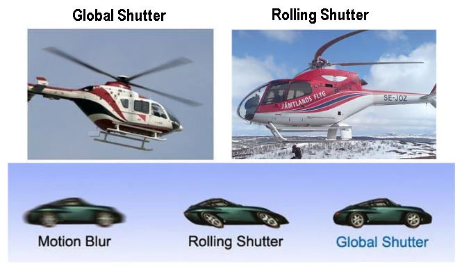

For anything with fast motion, a global shutter camera is better, since it captures all pixels at once. Rolling shutter, however, is cheaper to build and on scenes with slower motion, can do a better job capturing the world.

