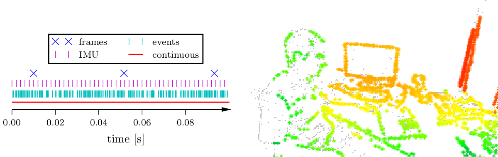

# Event Camera

Kevin J. Walchko, Phd

5 July 2020

---



## References

- [Event-based Vision, Event Cameras, Event Camera SLAM](http://rpg.ifi.uzh.ch/research_dvs.html)
- [uzh-rpg/rpg_dvs_ros](https://github.com/uzh-rpg/rpg_dvs_ros)
- [Event Cameras](https://www.microsoft.com/en-us/research/uploads/prod/2019/09/Davide_Scaramuzza_UZH.pdf)

## Comparison with Traditional Cameras

Traditional cameras suffer from:

- Latency
- Motion blur
- Dynamic range

Event cameras:

- Sensor only measures only motion in the scene
- First commercialized in 2008 under the name of Dynamic Vision Sensor (DVS)
- Low-latency (~1 usec)
- No motion blur
- Asyncronous pixel response, no intensity information, just polarity
- High dynamic range (140 dB instead of 60 dB)
- Ultra-low power (mean: 1mW vs 1W)

## Messsage

`EventArray.msg`

```
# This message contains an array of events
# (0, 0) is at top-left corner of image
#

Header header

uint32 height         # image height, that is, number of rows
uint32 width          # image width, that is, number of columns

# an array of events
Event[] events
```

`Event.msg`

```
# A DVS event
uint16 x
uint16 y
time ts
bool polarity
```
