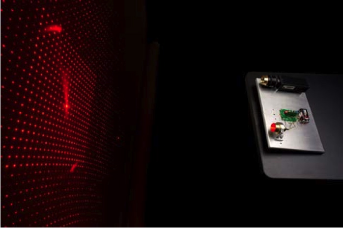
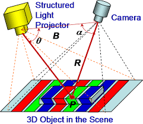

# Structured Light

Kevin J. Walchko, PhD

20 Dec 2020

# Depth Camera



The EX8029 has two cameras (stereo) and produces depth images. Looking at both the data and reading the *very limited* description of how it works, it is not a *true* depth camera. Instead, there is a projector (square silver thing) on the front that projects a known pattern and a chip inside calculates the disparity seen between the left/right cameras. This type of sensor is using a technique called structured light. 

[Structured light](https://en.wikipedia.org/wiki/Structured_light) is the process of projecting a known pattern (often grids or horizontal bars) on to a scene. The way that these deform when striking surfaces allows vision systems to calculate the depth and surface information of the objects in the scene.


Typically, people use the disparity map instead of a true depth map to do things. However, if you wish to recreate the 3D environment, where the disparity map was captured, then you have to turn it into a **true** depth map as discussed above.


## Using a Projector

You can scan a static scene using a normal projector and changing the displayed pattern.




```python

```
