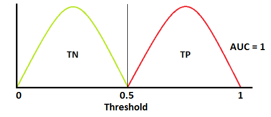
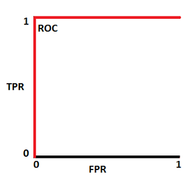
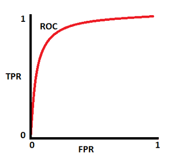
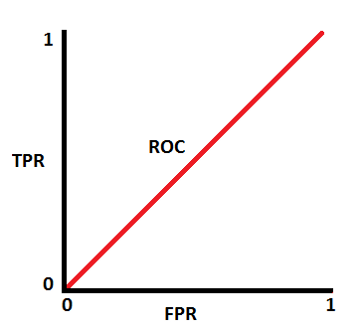
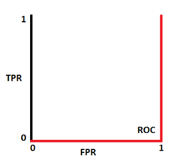

In real life, be afraid of anyone who says *"my model is 90% accurate"*. The reality is
things are more complicated than that. A ROC curve is one way to show the complex interaction
between correctly identifying what you want (True Positive (TP)) and falsely what you don't
want (False Positive (FP)).

## Terms

$$
TPR = Recall = Sensitivity = \frac{TP}{TP+FN} \\
Specificity = \frac{TN}{TN + FP} \\
FPR = 1 - Specificity = \frac{FP}{TN + FP} \\
Accuracy = \frac{TP + TN}{P + N} \\
Precision = \frac{TP}{TP + FP} \\
F-Measure = \frac{2*Recall*Precision}{Recall + Precision}
$$

- **F-Measure:** It is difficult to compare two models with low precision and high recall or vice versa.
F-score helps to compare these by measuring Recall and Precision at the same time. It uses Harmonic Mean
in place of Arithmetic Mean by punishing the extreme values more.

# Confusion Matrix

A confusion matrix shows the performance measurement for machine learning classification
problem where output can be one of two or more classes. An example is shown below with 4
different combinations of predicted and actual values for pregnancy.

# ROC Curve

## Relations

The following, taken from a great post, I am just putting it here so it doesn't disappear, show
the interactions of these two parameters and how they produce a ROC curve.

The Area Under the Curve (AUC) provides input as:

- AUC ~1 (100%) is perfect and there is great class sparation ... perfect ability to distinguish
between classes
- AUC = 0.7 means the model has a 70% chance to distinguish between the classes
- AUC ~0.5 means th emodel has no class separation
- AUC ~0 means the model is poor and is incorrectly reporting 0's as 1's and 1's as 0's

  

    
  

  

    
  

  

    
  

  

    
  

  

    
  

  

    
  

  

    
  

  

    
  

## References

- Meduim: [Understanding Confusion Matrix](https://towardsdatascience.com/understanding-confusion-matrix-a9ad42dcfd62)
- Medium: [AUC - ROC Curve](https://towardsdatascience.com/understanding-auc-roc-curve-68b2303cc9c5)
