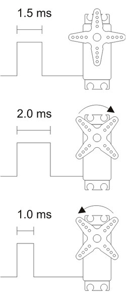
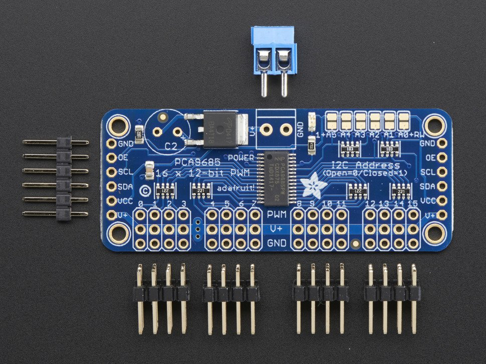

## RC Servo



## Control

There are many ways to control an RC servo and both the Arduino and the
RPi have software libraries to do that. However, that consumes a small
amount of overhead (processor power) and you may not want that.



Adafruit 16-Channel 12-bit PWM/Servo Driver - I2C interface
[PCA9685](https://www.adafruit.com/products/815) is a good hardware
solution that is controlled via i2c. This is nice, because you can hook
up a bunch of these and control more servos than you could ever want\!
The Adafruit
[tutorial](https://learn.adafruit.com/adafruit-16-channel-servo-driver-with-raspberry-pi)
does a great job of showing how to hook this up and the python library
is [here](https://github.com/adafruit/Adafruit_Python_PCA9685) in their
github account.

I used it to make a simple 4 legged (quadruped) robot.


## Python Software Servo with RPi.GPIO

You can also control servos from python via a variety of methods, one
is:

```python
#!/usr/bin/env python

from __future__ import division
import RPi.GPIO as GPIO
import sys
import time

angle = float(sys.argv[1])

def dc(a):
  DutyCycle = 7/180*a+5
  return DutyCycle

GPIO.setmode(GPIO.BCM)
GPIO.setup(26,GPIO.OUT)
pwm=GPIO.PWM(26,50)
pwm.start(5)
a=dc(angle)
pwm.ChangeDutyCycle(a)

time.sleep(1)
pwm.stop()
GPIO.cleanup()
```

This will turn an RC servo. Since the timing varies between servos, you
will have to adjust the duty cycle timing for your exact servo.

# References

- [PCA-9685 board instructions](pca9685.pdf)
