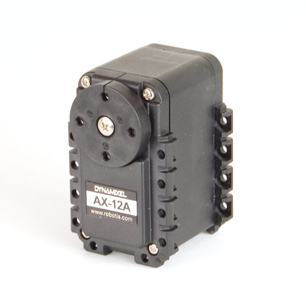
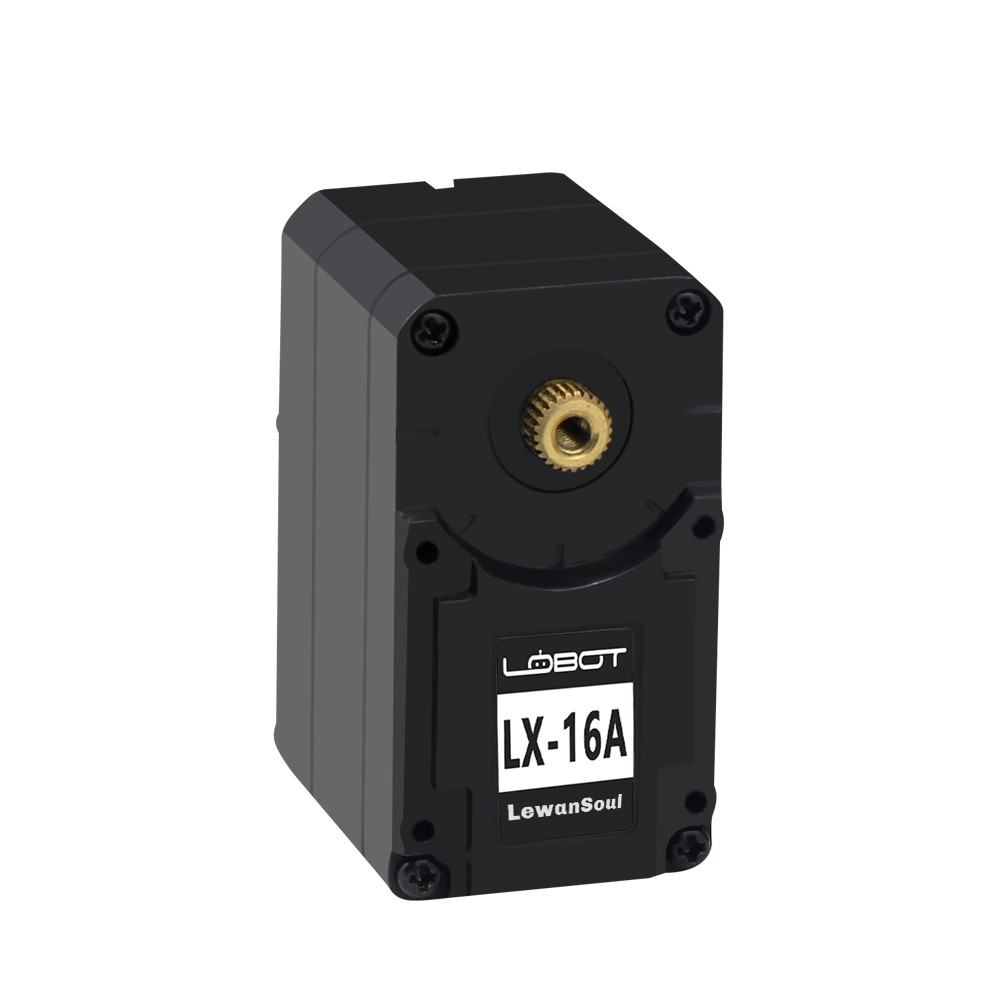
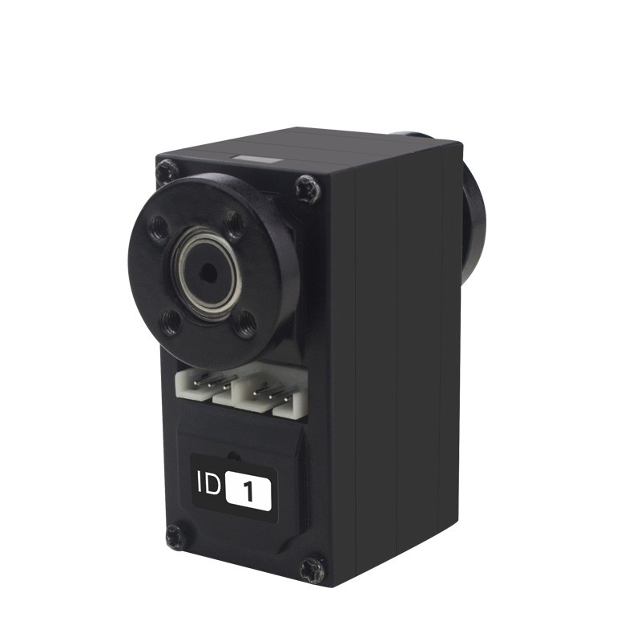
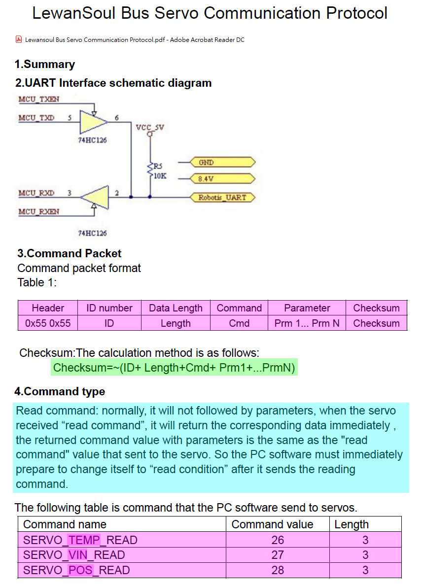
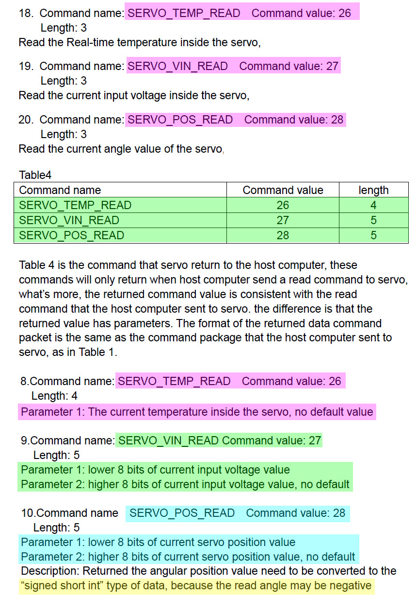
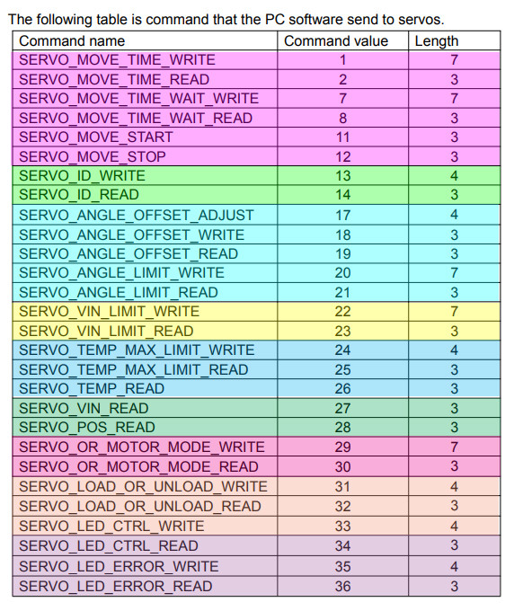

There are various smart servos out there now, I am use to using
Dynamixel servos.

| Name | Price | Torque | Voltage | Range | Comm | Link |
|------|-------|--------|---------|-------|------|------|
| AX-12A | $44.90 | 1.5 Nm | 9-12V  | 300 | 1Mbps     | [Robotis](http://www.robotis.us/ax-series/) |
| LX-16A | $17    | 1.6 Nm | 6-7.4V | 240 | 115.2kbps | [Lewansoul](http://www.lewansoul.com/product/detail-17.html) |
| LX-15D | $22    | 1.6 Nm | 5-8.4V | 240 | 115.2kpbs | [Lewansoul](http://www.lewansoul.com/product/detail-7.html) |

- both all are capable of continous rotation
- both HW and SW communications protocols are very very similar to Dynamixel Ver 1.0 used by the AX-12A
    - Half-duplex UART asynchronous serial interface


## Thoughts

| Feature | LX-xx | AX-12A Dynamixel |
|---|---|---|
| **servo horn** | self tapping screws         | M2 machine screws into nuts |
| **servo horn** | standard metal servo spline | plastic non-standard servo spline that is keyed |
| **wiring**     | plastic coated wires        | silicon coated wires (higher current) |
| **connectors** | LX-16A same as AX-12A, LX-15D unknown | AX-12A same as LX-16A |
| **datarate**   | 115.2kbps, standard rate, slower | 1Mbps, non-standard rate, fast, can be set to a slower rate if needed |
| **mounting**   | self tapping screws, 10 locations  | M2 machine screw and nut, 20 locations |
| **drivers**    | LX-16A many python drivers and very similar to Dynamixel, LX-15D unknown | lots of C++ and python drivers |
| **motor**      | cheaper internal motor (4-6V says internet tear down) ... life limiting? | higher voltage and quality motor |
| **voltage**    | not sure what top end is, some places say 8.4V (comm board) and some say 7.4V (website) | consistant documentation |
| **LED**     | There is a hole where it looks like a transparent window should be ... looks like QA missed something but they didn't | professional design and looking |

## Python Software Drivers

- [PyLX-16A github](https://github.com/ethanlipson/PyLX-16A)
- [lewansoul-lx16a](https://github.com/maximkulkin/lewansoul-lx16a) which you can get from [pypi](https://pypi.org/project/lewansoul-lx16a/) using `pip`
- [SGVHAK rover](https://github.com/Roger-random/SGVHAK_Rover) has an lx-16a driver in its source code

## LX-16A Test (Review?)

This is a test of the motor mode for the servos.

- They perform much like standard RC servos I have hacked to run
continuously. There is a very high pitch nose to them and they are
slow ... seemly slower than the datasheet specifies.
- Also, they are very easy to trip into current shutdown. The
slightest force seems to stop them ... not sure how they would perform
as wheel motors.
- Finally, once you have tripped them into an error state, it is seemly
imposible to get them out. The error light keeps blinking no matter what
I do. The motors operate fine, but the error light keeps blinking and
the `get_led_errors()` function keeps returning `7` to indicate all
thresholds were breached (current, temperature, and voltage). I hooked up
a volt meter and only saw 7.4V that I was putting in. Setting it to current
also showed no excessive current.


Install: `pip install lewansoul_lx16a`

```python
#!/usr/bin/env python

import serial
import time
from lewansoul_lx16a import ServoController

port = '/dev/serial/by-id/usb-1a86_USB2.0-Serial-if00-port0'
s = serial.Serial(port, 115200, timeout=1)
c = ServoController(s, timeout=5)

print(">> mode [0-servo, 1-motor]:", c.get_mode(1))
print(">> motor on (should be off):", c.is_motor_on(1))
print("------------------------------------")
print(">> max temperature[C]:", c.get_max_temperature_limit(1))
print(">> temperature[C]:", c.get_temperature(1))
print("------------------------------------")
print(">> max voltage[mV]:", c.get_voltage_limits(1))
print(">> voltage[mV]:", c.get_voltage(1))


# simple ramp up and then down
for x in range(0, 1000, 100):
    c.set_motor_mode(1, x)
    time.sleep(0.75)

for x in range(1000, 0, -100):
    c.set_motor_mode(1, x)
    time.sleep(0.75)

print(">> led errors:", c.get_led_errors(1))

c.set_motor_mode(1, 0)
```

Honestly, I was realy excited about a cheaper AX-12A servo, but these don't
seem to be reliable and capable enough ... not sure.

## Protocol







# References

- [tlfong01.blog](https://tlfong01.blog/2020/09/12/lx-224hv-servo-notes/)
- [LewanSoul Bus Protocol](protocol.pdf)
