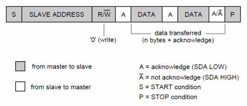

I2C (Inter-Integrated Circuit), pronounced I-squared-C, is a multi-master, multi-slave,
single-ended, serial computer bus invented by Philips Semiconductor (now NXP
Semiconductors). It is typically used for attaching lower-speed peripheral ICs to
processors and microcontrollers in short-distance, intra-board communication. Alternatively
I2C is spelled I2C (pronounced I-two-C) or IIC (pronounced I-I-C).

Addressing is based of a 7-bit addressing system, where each data packet looks like:


{width=600px}

If you have everything setup correctly, you should be able to see what is on your i2c bus
by typing:

```

[kevin@raspberrypi ~]$ sudo i2cdetect -y 1
     0  1  2  3  4  5  6  7  8  9  a  b  c  d  e  f
00:          -- -- -- -- -- -- -- -- -- -- -- -- --
10: -- -- -- -- -- -- -- -- -- -- -- -- -- -- -- --
20: 20 -- -- -- -- -- -- -- -- -- -- -- -- -- -- --
30: -- -- -- -- -- -- -- -- -- -- -- -- -- -- -- --
40: -- -- -- -- -- -- -- -- -- -- -- -- -- -- -- --
50: -- -- -- -- -- -- -- -- -- -- -- -- -- -- -- --
60: -- -- -- -- -- -- -- -- -- -- -- -- -- -- -- --
70: -- -- -- -- -- -- -- --
```

Note that something is attached to the `0x20` address.

# Python Scripts

Now use [Blinka](https://github.com/adafruit/Adafruit_Blinka) by Adafruit instead of the below.

```
pip install Adafruit_GPIO
```

Then a simple program might look like:

``` python
import Adafruit_GPIO as GPIO

io = GPIO.MCP23017(0x20)

for i in range(0,16):
io.setup(i,GPIO.OUT) # set all pins to output
pins = {1:1,3:0,5:1} # set pins 1&5 True and pin 3 False
io.output_pins(pins)
```

smbus-cffi

```
sudo apt-get install build-essential libi2c-dev i2c-tools python-dev libffi-dev
pip install smbus-cffi
```

```python
import smbus
# from Adafruit import smbus
import time

#bus = smbus.SMBus(0)  # Rev 1 Pi uses 0
bus = smbus.SMBus(1) # Rev 2 Pi uses 1

DEVICE = 0x20 # Device address (A0-A2)
IODIRA = 0x00 # Pin direction register
OLATA  = 0x14 # Register for outputs
GPIOA  = 0x12 # Register for inputs

# Set all GPA pins as outputs by setting
# all bits of IODIRA register to 0
bus.write_byte_data(DEVICE,IODIRA,0x00)

# Set output all 7 output bits to 0
bus.write_byte_data(DEVICE,OLATA,0)

for MyData in range(1,8):
  # Count from 1 to 8 which in binary will count
  # from 001 to 111
  bus.write_byte_data(DEVICE,OLATA,MyData)
  print MyData
  time.sleep(1)

# Set all bits to zero
bus.write_byte_data(DEVICE,OLATA,0)
```
```python
# from Adafruit import smbus
import smbus
import time

# bus = smbus.SMBus(0)  # Rev 1 Pi uses 0
bus = smbus.SMBus(1) # Rev 2 Pi uses 1

DEVICE = 0x20 # Device address (A0-A2)
IODIRA = 0x00 # Pin direction register
GPIOA  = 0x12 # Register for inputs

# Set first 7 GPA pins as outputs and
# last one as input.
bus.write_byte_data(DEVICE,IODIRA,0x80)

# Loop until user presses CTRL-C
while True:

  # Read state of GPIOA register
  MySwitch = bus.read_byte_data(DEVICE,GPIOA)

  if MySwitch & 0b10000000 == 0b10000000:
	  print "Switch was pressed!"
      time.sleep(1)
```

Converting between binary data and int, float, etc can be done with standard python libraries.

```python

import struct
import binascii

binascii.unhexlify('010f')  # '\x01\x0f'
struct.pack('>h',0x010f)  # big endian '\x01\x0f'
struct.pack('<h',0x010f)  # little endian '\x0f\x01'

b = struct.pack('<h',0x0101)  # '\x0f\x01'
struct.unpack('<h', b)  # (257,)

# little endian conversions
struct.unpack('<h','\x00\xef')  # (-4352,) signed short
struct.unpack('<H','\x00\xef')  # (61184,) unsigned short
struct.unpack('<f','\x01\x01\xff\xaa')  # (-4.529779600460221e-13,) float
```

# References

* [wikipedia i2c](https://en.wikipedia.org/wiki/I%C2%B2C)
* [struct python docs](https://docs.python.org/2/library/struct.html?highlight=struct#module-struct)
